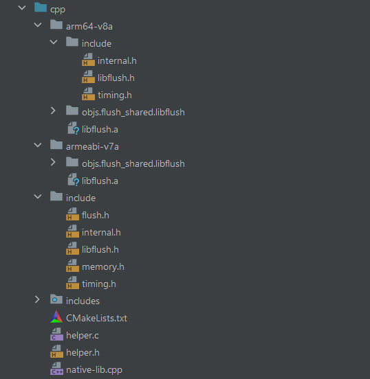

# Cache Side-Channel on ARM based Android
Library to build cross-platform cache attacks from [armageddon](https://github.com/IAIK/armageddon/tree/master/libflush)
## Build
build armageddon:
Inside armageddon/libflush
```bash
ndk-build NDK_APPLICATION_MK=Application.mk NDK_PROJECT_PATH=`pwd`
```

## Cmake
Need these in cmakelists.txt
```bash
include_directories(${CMAKE_SOURCE_DIR}/armeabi-v7a/include ${CMAKE_SOURCE_DIR}/include)
add_library(${CMAKE_PROJECT_NAME} SHARED
        # List C/C++ source files with relative paths to this CMakeLists.txt.
        native-lib.cpp helper.c)

target_link_libraries(${CMAKE_PROJECT_NAME}
        # List libraries link to the target library
        android
        log
        ${CMAKE_SOURCE_DIR}/armeabi-v7a/libflush.a)
        #${CMAKE_SOURCE_DIR}/arm64-v8a/libflush.a)
```

## Gradle

```bash
defaultConfig {
        applicationId = "com.example.tempc"
        minSdk = 22
        targetSdk = 33
        versionCode = 1
        versionName = "1.0"

        testInstrumentationRunner = "androidx.test.runner.AndroidJUnitRunner"
        ndk {
            //abiFilters.add("arm64-v8a")
            abiFilters.add("armeabi-v7a")
        }
    }
```
## Directory Tree(temp)




## Fix "Allow USB debugging" keeps on popping up


If the "Allow USB debugging" message is shown again and again then this is usually a problem of the host, not of the Android device.
You should reset the Android ADB authentication key by deleting it and then restarting ADB. A new authentication key (pair) will be generated which will hopefully work.
To do so delete the files adbkey and adbkey.pub in the folder ~/.android/.
Then execute adb kill-server and finally restart adb by executing adb start-server.
Note that this will reset USB ADB authorization of all devices you had connected to that PC/user account.

